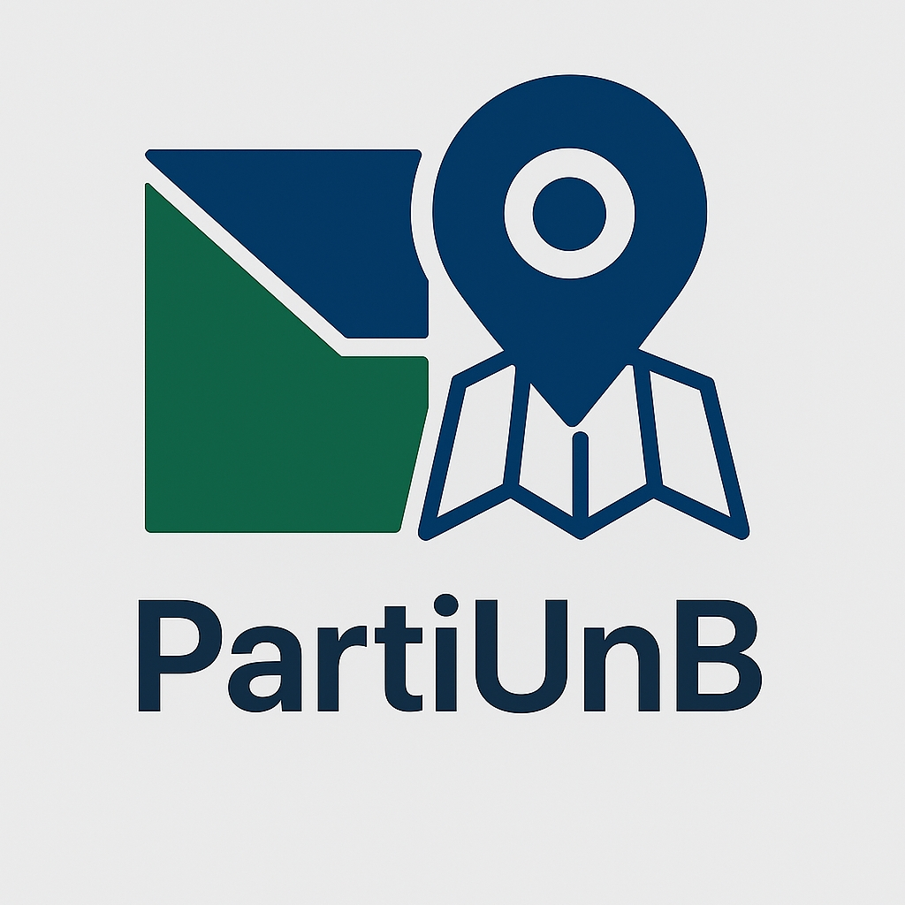
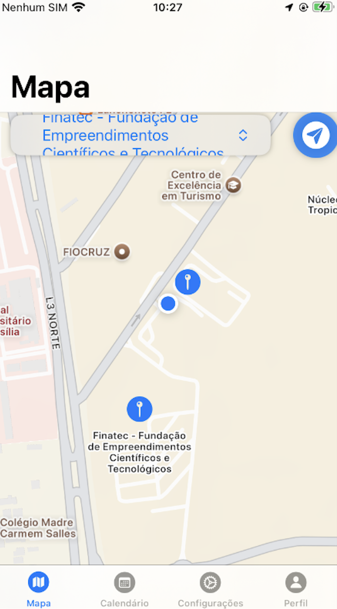
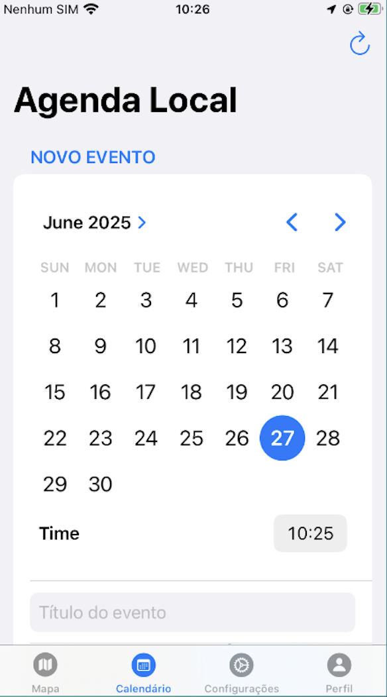
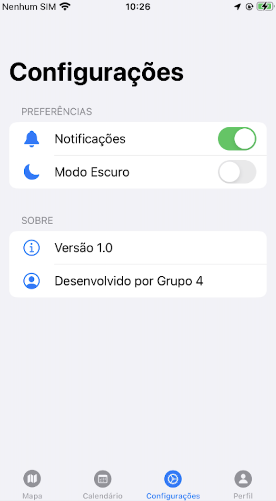
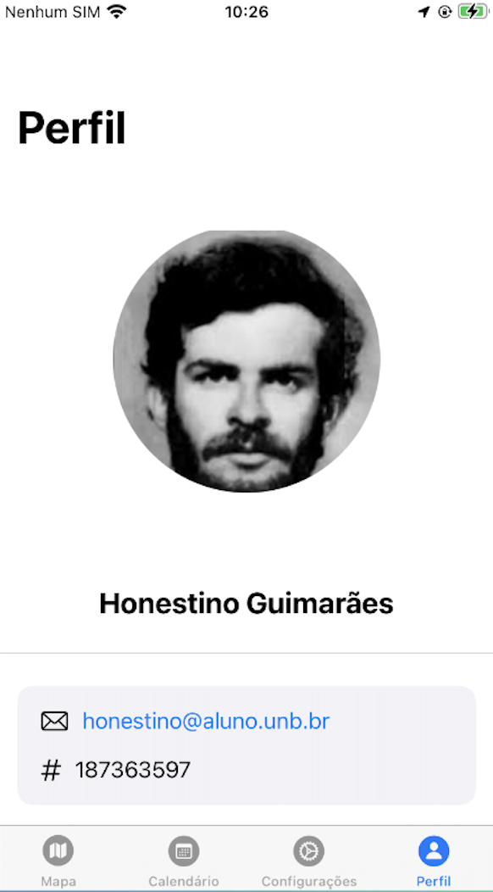

# PartiUnB - UnB Campus Navigator & Event Guide

  

## 🚀 Introduction

PartiUnB is an iOS application designed to help students, faculty, and visitors navigate the sprawling University of Brasília (UnB) campus and stay informed about the latest events.

## 🎯 The Problem

The University of Brasília's main Darcy Ribeiro campus is immense, covering over 400 hectares, which presents a significant navigational challenge. Furthermore, with a daily circulation of over 50,000 people, especially during large events like the University Week, there is a clear difficulty in effectively promoting and locating campus events.

## ✨ Our Solution

PartiUnB tackles these challenges by providing a centralized and user-friendly platform for:

* **Navigation**
* **Information**
* **Event Promotion**

## 📋 Features

* **Event Locator:** Pinpoints events in space and time.
* **Location Directory:** Lists all major locations within the UnB campus.
* **Daily Event Filtering:** Allows users to filter and view events happening on a specific day.

## 🛠️ Technologies Used

* **Frontend:** Swift, SwiftUI
* **Backend:** Firebase, Postman, Node-RED, Cloudant
* **Maps:** Apple MapKit

## 📱 App Screens

  
  
  
  

## 👥 Project Team

This project was conceived and developed by:

* Daniel Monteiro
* Daniel Nunes Duarte
* Gabriel Moretto
* João Victor Tavares
